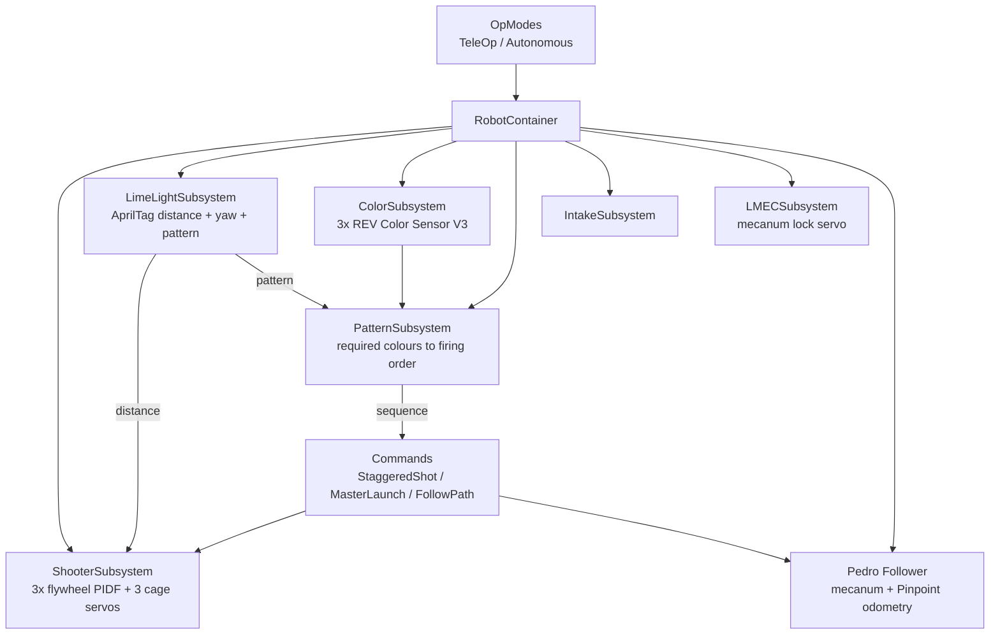

# DECODE Robot Software (2025–26)

Java robot code for **Exsurgo Nova (FTC #30210)** for the FIRST Tech Challenge *DECODE* season.
The robot drives a mecanum chassis, aims at the goal using AprilTag vision, spins up a three-flywheel
shooter to a distance-based speed, and fires balls in the colour order the match requires.

Built on the [FTC SDK](https://github.com/FIRST-Tech-Challenge/FtcRobotController) (v11.0.0). The
original SDK README is kept in [`doc/FTC_SDK_README.md`](doc/FTC_SDK_README.md).

## Highlights

- **Command-based architecture.** Subsystems, commands and command groups (FTCLib) keep robot
  behaviour composable and easy to reorder, especially for autonomous routines.
- **Vision-assisted aiming.** A Limelight 3A finds the alliance AprilTag, estimates distance from tag
  area, and drives a heading lock with a nonlinear power curve.
- **Closed-loop shooter.** Three flywheel motors use velocity PIDF control. Target speed is derived
  from distance, and the controller rumbles when the flywheels are up to speed.
- **Colour-sorted shooting.** Three REV Color Sensor V3 units read the ball in each cage. The
  pattern tags (IDs 21–23) set the required colour order, and the code builds a firing order to match,
  falling back gracefully if a colour is missing.
- **Path-following autonomous.** Pedro Pathing with goBILDA Pinpoint odometry. Red and Blue routines
  share one path definition through pose mirroring instead of duplicated code.
- **Tuning tools.** Live-editable PIDF values for the flywheel (`RPMTest`) and the Pedro tuning suite.

## Architecture



**Vision to shot.** Each loop, `RobotContainer` reads the alliance tag from the Limelight, converts tag
area to distance (`SCALE / sqrt(area)`), and turns that into a flywheel speed
(`0.003 × distance + 0.475`, clipped to 0.625–0.845 of max velocity). The delay between the three
shots also scales with distance, with a separate constant when sorting mode is on.

**Sorted shot.** `ColorSubsystem` reports the colour in each cage, `LimeLightSubsystem` reports the
required pattern, and `PatternSubsystem.buildSequence` picks which cage to fire in each of the three
slots. `StaggeredShotCommand` then fires them with staggered timing.

**Autonomous.** Each routine is an abstract base class (`Config/AutoBases`) that schedules a
`SequentialCommandGroup` of `FollowPathCommand`, intake, and launch commands. Paths live in
`Config/Core/Paths`, and Red is generated by mirroring the Blue poses.

## Project layout

```
TeamCode/src/main/java/org/firstinspires/ftc/teamcode/
├── OpModes/
│   ├── TeleOp/            TeleOpRed, TeleOpBlue
│   ├── Autonomous/        Close, Close MMA, Close Sorted 12/15, Far (Red + Blue)
│   └── Testing/           RPMtest, LimelightTest
└── Config/
    ├── Core/              RobotContainer, Paths/, Util/ (enums, OpModeCommand)
    ├── Subsystems/        Shooter, LimeLight, Color, Pattern, Intake, LMEC
    ├── Commands/          Custom/ and CommandGroups/
    ├── AutoBases/         Shared autonomous logic
    ├── Drivers/           goBILDA Pinpoint driver
    └── pedroPathing/      Follower constants and the Pedro tuning suite
```

## Driver controls (gamepad 1)

| Input | Action |
|---|---|
| Left stick / right stick X | Field-centric drive / rotate |
| Left bumper (hold) | Aim: heading lock to the alliance tag, spin up the shooter. Switches to shooting once aligned within 2° |
| Right bumper | Fire all three balls, staggered, in the sorted order |
| D-pad left / up / right | Fire the left / middle / right cage |
| Y | Toggle sorting mode (changes shot timing) |
| A (hold) | Load mode: opens all cages and reverse-spins the flywheels |
| Right trigger (hold) | Intake state, cages to intake position |
| D-pad down (hold) | Outtake |
| Left trigger (hold) | Lock the mecanum servo |
| Back | Reset heading |

The controller rumbles when the flywheels reach speed and when the intake is full.

## Hardware configuration

| Device | Config name |
|---|---|
| Shooter flywheels | `shooterOne`, `shooterTwo`, `shooterThree` |
| Cage servos | `cageLeft`, `cageMiddle`, `cageRight` |
| Color sensors | `colorLeft`, `colorMiddle`, `colorRight` |
| Intake motor | `intakeMotor` |
| Limelight 3A | `limeLight` |
| Mecanum lock servo | `LMECBack` |
| Odometry (Pinpoint) | `odo` |
| Drive motors | `frontLeft`, `frontRight`, `backLeft`, `backRight` |

## OpModes

| Group | Name |
|---|---|
| Match TeleOp | `TeleOp Red`, `TeleOp Blue` |
| Red / Blue autonomous | `Auto Close`, `Auto Close MMA`, `Auto Close Sorted 15`, `Auto Far` |
| Disabled | `Auto Close Sorted 12` (Red and Blue) |
| Testing | `RPMTest` (live flywheel PIDF), `LimeLightTest`, `Tuning` (Pedro Pathing) |

## Build and deploy

1. Install Android Studio Ladybug (2024.2) or later.
2. Clone this repository and open it in Android Studio.
3. Let Gradle sync, then build and deploy `TeamCode` to the Control Hub.

Key dependencies: FTC SDK 11.0.0, FTCLib 2.1.1, Pedro Pathing 2.0.5, Panels (bylazar) 1.0.9,
FTC Dashboard 0.5.0.

## Tuning

- **Flywheel:** run `RPMTest`, adjust `testP/I/D/F` live in Panels, and copy the result into
  `ShooterSubsystem`.
- **Distance to power:** the calibration points are recorded as comments in `ShooterSubsystem`.
- **Path following:** run Pedro's `Tuning` OpMode and update `pedroPathing/Constants.java`.

## Known issues and roadmap

- The intake motor output is **disabled** in `IntakeSubsystem` (marked TODO) because the hardware was
  broken at the time of writing.
- The Sorted 12 autonomous routines are `@Disabled`.
- `Back` is bound to two commands in `teleOpControl()` (heading reset and IMU reset).
- `TeleOpRed` does not reset the command scheduler on init the way `TeleOpBlue` does. It should.
- Ball colours are stored as `Object[]` of characters. An enum would be safer.
- Calibration constants are hard-coded in several places and should move to one config class.
- No automated tests yet. `PatternSubsystem` is a good first candidate once its logic is separated
  from the FTCLib subsystem base class.

## Credits and license

Built on the [FTC SDK](https://github.com/FIRST-Tech-Challenge/FtcRobotController), plus
[Pedro Pathing](https://pedropathing.com/), [FTCLib](https://github.com/FTCLib/FTCLib),
[Panels](https://github.com/Lazar-dev/panels), and the goBILDA Pinpoint driver. Licensed under the
terms in [`LICENSE`](LICENSE).

Software by Kai Williams ([@KaizDoodle](https://github.com/KaizDoodle)) and the Exsurgo Nova
programming team.
